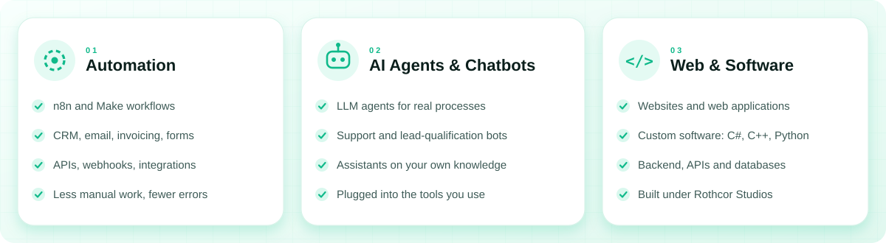
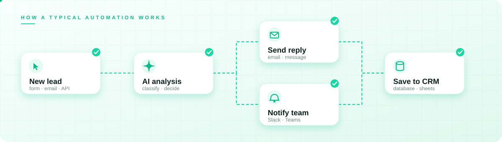
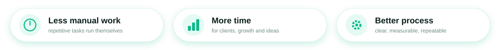

<div align="center">



<br/>

<a href="https://rothcor.pl"></a>
<a href="https://www.linkedin.com/in/mateusznako"></a>

</div>

<br/>

## About

I'm a **21-year-old founder and developer from Warsaw, Poland**. I run **[Rothcor AI](https://rothcor.pl)**, an agency that automates the repetitive parts of business, and **Rothcor Studios**, where we build websites, applications and custom software.

I trained as a programming technician (INF.03 and INF.04 professional exams passed with top results) and I'm studying **Computer Science with an AI specialization** in Warsaw. Alongside that I work hands-on in a bookkeeping firm, so I know how real business processes look from the inside, not only from tutorials.

```python
class Mateusz:
    role      = ["Founder @ Rothcor AI", "Founder @ Rothcor Studios"]
    location  = "Warsaw, Poland"
    studying  = "Computer Science (AI specialization)"
    languages = ["C#", "C++", "Python", "JavaScript", "TypeScript", "SQL"]
    focus     = ["AI automation", "AI agents", "chatbots", "web apps", "custom software"]
    markets   = ["Global (English)", "B2B Poland"]

    def now(self):
        return "Shipping client systems and building in public"
```

<br/>

## What I do



<br/>

## How it works





<br/>

## Companies

| | Company | What it is |
|:-:|---|---|
| 🟢 | **[Rothcor AI](https://rothcor.pl)** | Automations in n8n and Make, AI agents, chatbots, integrations |
| ⚪ | **Rothcor Studios** | Websites, online stores, applications and custom software |

> Want to automate something in your business? **[rothcor.pl](https://rothcor.pl)**

<!--
  OPTIONAL: brand posters gallery.
  1. Save your three posters into the assets/ folder as: poster-ai.png, poster-agency.png, poster-studios.png
  2. Delete this comment markers (the opening and closing lines) to show the section.

<br/>

## Rothcor

<p align="center">
  
  
  
</p>
-->

<br/>

## Tech stack

**Languages**


**Databases**


**Backend and frameworks**


**Automation and AI**


**Tools**


<br/>

## Let's connect

I share content about AI automation, building an agency and shipping products, mostly in English. I'm also open to **B2B collaborations in Poland**, and LinkedIn is the best place to start.

<div align="center">

<a href="https://www.linkedin.com/in/mateusznako"></a>
<a href="https://rothcor.pl"></a>

<br/><br/>

<a href="https://rothcor.pl"></a>

</div>
